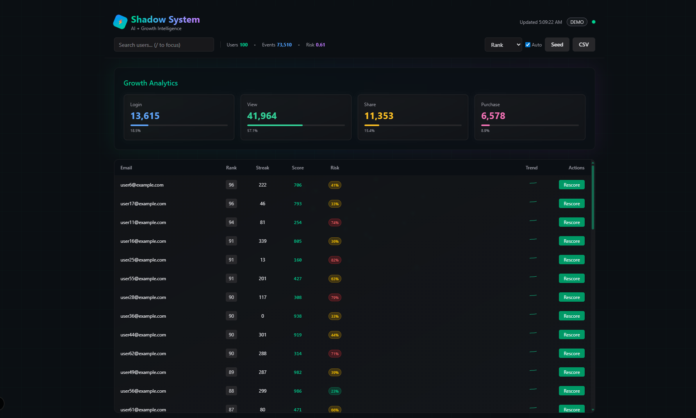

# Shadow System ⚡

AI-powered Growth Intelligence Dashboard — Synthetic user analytics, churn prediction, and growth insights in a modern web interface.

[](https://shadow-system-psi.vercel.app/)
[](https://www.loom.com/share/03d20338250d4d699502ff817591a1de?sid=f2f8c111-814a-4ead-a60a-cb42db4f143f)

<div align="center">
  
  <p><em>Screenshot placeholder - Dashboard with synthetic user analytics and predictive scoring</em></p>
</div>

---

## 🚀 Quickstart

```bash
git clone https://github.com/Xixos/shadow-system.git
cd shadow-system
npm install && npm run dev
# Open http://localhost:3000
```

## 🎬 Demo Script

- **Seed Data** → Click "Generate Users" to populate synthetic user profiles and events
- **Select User** → Choose a user from the table to view detailed analytics and risk scores
- **Rescore** → Hit the predictive rescore button to simulate ML model updates
- **Insights** → Explore growth charts, churn predictions, and sparkline trends
- **Shortcuts** → “/” focus search, A auto, 1–4 change sort, C export CSV, S Seed Data

## 🛠️ Tech Stack

**Frontend**
- Next.js 15 + React 18 + TypeScript
- Tailwind CSS, Framer Motion (micro-interactions)
- Recharts (charts), Lucide React (icons)

**Backend (Optional)**
- FastAPI + SQLite (persistence)
- Synthetic data generator + REST endpoints

**Dev & Deploy**
- ESLint + Prettier
- Vercel-ready (zero-config Next.js)

## 📝 Notes

- All user data is **synthetic** — no real personal information is used or stored
- `LLM_OFF=true` by default for privacy-focused demo environment
- Safe for public demos and portfolio showcasing
- Backend integration is optional; the frontend runs standalone with mock data

## Contact

**Seydina Diop**  
[LinkedIn](https://www.linkedin.com/in/seydina-diop/) • [GitHub](https://github.com/Xixos)